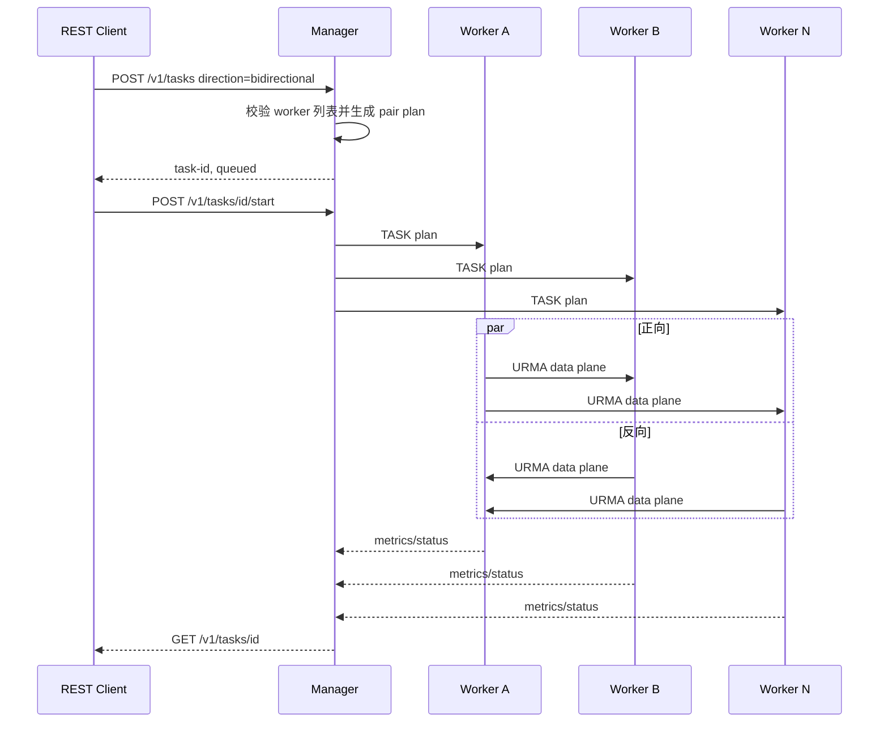

# kv-bench 设计文档（基于 URMA）

> 通用 URMA 性能测试工具：带宽 / 时延，模拟 KV 打流。
> 实现参考同级目录 `yuanrong-datasystem`（`src/datasystem/common/rdma/*`），
> 剥离 bthread/brpc/protobuf/TBB 等第三方依赖，只保留"KV 调 URMA"的代码模型。
> **本文档与当前代码（`main` 分支）保持一致**；参考实现的行号仅作溯源。

---

## 1. 目标与能力

### 1.1 多节点 manager/worker 控制面

除兼容的 `--server-ip` 直连模式外，程序支持统一的 worker 节点模式：

- Python manager 是独立控制组件，不初始化 URMA；它通过 SSH 执行 `rpm -qa`、部署 artifact，并在 URMA 版本不一致时对节点单独编译。manager 基于 FastAPI + uvicorn，前端为 Vue 3 + Vite + Element Plus 单页应用（FastAPI 托管构建产物）；任务状态（`tasks.json`）、节点部署状态（`deploy_status.json`）与每任务结果/日志（`runs/{task_id}/`）持久化到运行目录。接口语义见 [manager/README.md](manager/README.md)。
- worker 是 `kv-bench --worker` 启动的常驻 HTTP 服务，不注册、不回连 manager；worker API 在同一进程内调用测试入口启动和停止任务。
- 任务的 `bench_item {src, dst, type}` 按拓扑描述数据流，`type` 为 `forward`、`reverse` 或 `bidirectional`。
- manager REST API 为 `POST /v1/deploy`、`GET/POST /v1/tasks`、`POST /v1/tasks/{id}/start`、`POST /v1/tasks/{id}/stop`、`GET /v1/tasks/{id}/result` 和 `GET /v1/tasks/{id}/logs`；worker API 为 `GET /v1/health`、`POST /v1/tasks/start` 和 `POST /v1/tasks/{id}/stop`。

多对多任务的控制流程如下：



`reverse` 表示把任务计划中的数据流方向反转，而不是把 worker 变成旧模型中的
server。`bidirectional` 则在同一任务内同时安排正向和反向流，用于测试双向流量
下的吞吐、延迟和错误率。

| 能力 | 说明 |
| --- | --- |
| 带宽测试 | 全速打流（`--qps 0`），统计吞吐（MB/s 大 B 与 Mb/s 小 b 双单位）与 IOPS |
| 时延测试 | 固定 QPS 节流打流，统计 avg / p50 / p90 / p99 / p999 / p9999 / pmax（us） |
| 操作类型 | `write`（KV Put：客户端分片流水线直写服务器内存）、`get`（KV Get：**客户端直接 READ 服务器数据区**，`URMA_OPC_READ`，见 §6）、`mixed`（按 `--mixed-ratio` 混合） |
| 分片流水线 | **write：一个 KV 请求 = 8MB（固定）**，每请求 1 条 jetty、拆 2 条 4MB WR（同一 chip），**一次并发发 10 个请求（80MB）**，请求间交替 chip1/chip2（第 1 个 8M chip1、第 2 个 8M chip2，5+5 均匀打散）；`--concurrency` + `--concurrency-unit req\|req_group`（req_group=在飞批次(10 请求)数 1~10 / req=在飞请求数 1~100），`--single-chip 1\|2` 单 chip + 内存亲和场景；**jetty 池驱动发送**（有请求一直发，取不到可用 jetty 就等待释放后再继续），见 §6.1 |
| bonding 亲和 | `affinity`（**分片源==目的==同一 chip**，交替打散双 chip）、`anti`（源随机 & 目的固定）、`none`（源/目的全随机），见 §8 |
| 可配置 | 线程数 `--threads`、时长 `--duration`、目标 QPS `--qps`（请求/秒）、请求并发度 `--concurrency`、单 chip `--single-chip`、jetty 池大小 `--jetty-count` 等 |
| 依赖 | 仅 liburma + pthread；无 bthread/brpc/protobuf/TBB/gflags |

---

## 2. 总体架构与文件布局

```
kv-bench/
├── CMakeLists.txt                URMA_ROOT 查找、KV_BENCH_BONDP_CTL 编译选项
├── README.md                     使用说明（构建/CLI/亲和三模式/import 说明）
├── DESIGN.md                     本文档
└── src/
    ├── kv_bench.cpp              业务层（单文件 ~1800 行）：参数解析/亲和/chip/
    │                             打流引擎/get 直接 READ/统计/首错即中断
    ├── hist.h                    HdrHistogram-lite（ns 精度 3 位有效数字）
    └── urma/
        ├── urma_manager.{h,cpp}  管理层：Init/设备发现/RegisterBuffer/握手
        │                         (Exchange：WireInfo 交换 + import)/AcquireSendLane/
        │                         PostWrite 系列/轮询线程+事件槽/Stop
        ├── urma_resource.{h,cpp} 资源层：UrmaResource + RAII 句柄
        │                         (context/jfce/jfc/jfr/jetty/targetJetty/segment)
        └── urma_send_lane.h      SendJettyPool（线程安全内建，FIFO 空闲队列轮转）
Provider 层  liburma (umdk)        urma_* API（urma_api.h / urma_ubagg.h）
```

### 分层职责（对齐参考分层，业务杂质剥离）

```
业务层   kv_bench.cpp             选项/亲和(chip)/打流引擎/get 直接 READ/统计
管理层   urma_manager.*           UrmaManager：init/设备发现/握手(交换+import)/
                                  AcquireSendLane/PostWrite 系列(内联 PostJettyRw)/
                                  轮询线程+事件槽/清理
资源层   urma_resource.*          UrmaResource + RAII 句柄 + SendJettyPool 委托
池对象   urma_send_lane.h         SendJettyPool（每分片取"新的"空闲 jetty）
Provider liburma (umdk)           urma_* API
```

### 线程模型（无 bthread，全部 std::thread / pthread）

- **客户端**：1 主线程（run_client）+ N 打流线程 + 1 URMA 轮询线程（进程级共享 JFC）+ 1 统计采样线程。
- **服务器**：1 accept 线程（非阻塞轮询）+ 1 URMA 轮询线程（如不主动发 WR 则不启动）。get 为客户端发起 READ，服务器无回写线程。

---

## 3. 初始化流程（UrmaManager::Init → UrmaResource::Init）

对齐参考 `UrmaManager::Init L246 / UrmaResource::Init L724`：

```
urma_init
  → urma_get_device_by_name(dev_name)          （默认 bonding0；失败返回）
  → GetEidIndex(dev)：遍历设备 eid 选首个可用
  → urma_create_context(device, eidIndex)
  → urma_create_jfce / urma_create_jfc(depth)
  → （可选，编译期）bonding balance 模式：
      #ifdef KV_BENCH_BONDP_CTL  urma_user_ctl(URMA_USER_CTL_BONDP_BONDING_MODE,
                                   BONDP_BONDING_MODE_BALANCE)   ← 默认开
  → 创建 send jetty 池：max(--jetty-count, threadsMin) 条 send jetty
      （共享 JFR；jfsCfg：depth=256、max_sge=2、multi_path=1、order_type(RS)）
  → 首个打流线程注册时 EnsurePollThread() 启动轮询线程
```

- `UrmaResource::Init` 返回后业务层 `RegisterBuffer(va, len)` 注册单个本地段（`localSeg_`），供握手发布与数据面使用。
- **balance 编译选项**：`urma_ubagg.h` 已引入（类型可用），`urma_user_ctl` 调 balance **默认开**（`KV_BENCH_BONDP_CTL=ON`）；部分平台/UMDK 版本不可用或驱动崩溃时 `-DKV_BENCH_BONDP_CTL=OFF`。

---

## 4. 握手与 import（UrmaManager::Exchange）

纯 TCP + POD 固定布局（`WireInfo`，packed，无 protobuf/brpc）。单次同步交换：

```
struct WireInfo {                 // __attribute__((packed))
  urma_eid_t      eid;            // 本进程 eid
  uint32_t        uasid;
  uint64_t        seg_va;         // 本地注册段
  uint64_t        seg_len;
  uint32_t        seg_flag;       // 段属性
  uint32_t        seg_token_id;
  urma_jetty_id_t jetty_id;       // 进程级共享 RECV jetty（发布供对端 import）
  uint32_t        threads;        // 打流线程数
  uint32_t        op_code;        // write/get/mixed
  uint32_t        dual_mode;      // mirror/split
  uint32_t        value_size;
  uint32_t        dst_chip;       // 本进程数据落地目的 chip
  uint32_t        reserved[2];
};
```

流程（client/server 对称）：

```
client                                  server
  |—— connect（阻塞，无超时）———————>|
  |—— 写 localWire —— 读 remoteWire ——>|   （SockSyncData：write 全部 + read 循环）
  |   （各自 import 对端资源）            |
```

1. 先发布进程级共享 RECV jetty（`GetOrCreateSharedRecvJetty`，独立 JFR，惰性创建），其 `jetty_id` 写入 localWire。
2. 交换完成后各自 import 对端：
   - **默认（bondp CTP）**：`bondp_rjetty_t`，`tp_type=URMA_CTP`、`flag.bs.has_drv_ext=1`、**`bondp.jetty = nullptr`**（对齐参考 `ImportRemoteJetty/FinalizeOutboundConnection`；传本地 jetty 指针在部分固件崩溃——见 §12）。失败自动回退普通 `urma_rjetty_t`（`tp_type=URMA_RTP`）。
   - **`--import-rtp`**：直接走普通 RTP import（跳过 bondp/CTP），用于头库版本不匹配或 bondp 驱动崩溃的绕行。
   - RC 模式（`--trans-mode 1/3`）：import 成功后把所有本地 send jetty 绑定到对端 target jetty。
3. `import_seg` 对端 segment（`peer.seg`）。
4. 握手读/写均**阻塞无超时**（`connect` 阻塞等待内核握手；`SockSyncData` read 循环无限等待，对端关闭连接时报 `peer closed`）。

**握手参数**（`HandshakeParams`）：threads / opCode / dualMode / valueSize / dstChip / transMode，随 TCP 发送。

---

## 5. 完成模型（事件槽 + 单轮询线程）

对齐参考 `ServerEventHandleThreadMain → PollJfcWait → CheckAndNotify`，但**去掉了 map+CV**，改为**每打流线程固定事件槽数组**：

```
常量：kEventSlotsPerWorker = 256，kRidShift = 40，kRidMask = 2^40-1
事件 token：token = generation<<8 | slotIndex
事件槽编码：user_ctx = (workerId << 40) | token
槽状态：token<<2        （已登记，等待完成）
        token<<2 | 1    （成功完成）
        token<<2 | 2    （失败完成）
        0             （空闲/复位）
```

- `PostEvent(workerId, token)`：从该 worker 的空闲槽栈取槽，递增槽 generation，登记 `token<<2`（RELEASE）；槽满时返回失败形成背压，绝不覆盖未消费事件。最大在飞 200 WR，小于 256 槽，并由 `static_assert` 约束。
- **轮询线程**（进程级单线程）：`urma_poll_jfc(jfc, 32, crs)` 循环；每个 CQE 按 `user_ctx` 拆 `workerId/token`，仅在 generation 完全匹配时 CAS 到成功/失败完成态。迟到 CQE 无法命中新一代事件。
- `ProbeEvent` / `WaitEvent`：消费完成态后才把槽归还空闲栈；`WaitEvent` 超时只取消同一代 token，并不取消已经提交给硬件的 WR。调用方不会把对应 lane 放回池中，而是隔离到连接销毁，避免迟到 WR 与新 WR 共用 lane。
- `AbortEvent`：post 失败时仅取消完全匹配的 token，旧 token 不会清掉复用后的新事件。
- 数据面（write 分片流水线）：每个分片 `PostWrite`（事件 ue）→ `ProbeEvent` 轮询完成 → 完成一个补发一个（见 §6.1）；get 为 `PostRead` 直接 READ（见 §6.3）。

**send lane（每个 8MB send 取一条 jetty）**：`SendJettyPool`（urma_send_lane.h）内部自带 `std::mutex`，`Add/PopIdle/Release/Remove/GetStats/At`；`PopIdle` 从 FIFO 空闲队列头部取下标，`Release` 从尾部归还。同一个 send 的两条 4MB WR 共用该 jetty，请求完成后归还 10 条 jetty。池大小 = `max(--jetty-count, threads, 10×在飞请求数)`。

---

## 6. 数据通路（KV 模型，模拟 QPS）

### 6.1 write 分片流水线（核心模型）

**一个 KV 请求 = 8MB（固定）= 2 条 4MB WR**（`KV_CHUNK_SIZE=4MB`、`KV_WR_PER_GROUP=2`、`KV_GROUP_SIZE=8MB`）。**一次并发发 10 个请求**（`KV_GROUPS_PER_REQ=10`，共 80MB = `KV_REQ_SIZE`）。每个请求：
- 一条 jetty（lane），拆 **2 条 4MB WR**（同一 jetty、同一 chip，`src==dst`）；
- **亲和（`--affinity-mode affinity`）= 请求源与目的在同一 chip**：请求在批次内序号 `g`（0..9）→ `chip = g % 2 ? 2 : 1`（第 1 个 8M chip1、第 2 个 8M chip2，10 请求 = 5+5 交替打散）；`--single-chip 1|2` 时全部请求固定单 chip。

**`--concurrency N` + `--concurrency-unit <req|req_group>`**：`req_group`（默认）= 在飞批次（10 个 8M 请求）数 ≤ N（1~10，窗口 10×N 请求）；`req` = 在飞请求（8M）数 ≤ N（1~100，窗口 N 请求）。

**jetty 池驱动流水线**（发送节奏由 jetty 池容量决定）：

```
循环（直到时长结束）:
  收完成: ProbeEvent 扫描全部在飞槽，完成的 → bytes += 8MB、该批第 10 个请求
          完成时 hist.Record(批时延)、归还 jetty（腾出池容量）
  发送:   有请求就一直发 8M 请求（每请求取一条新 jetty）
          取不到可用 jetty（池空）→ 等待在飞请求完成释放后继续
          请求边界受 --concurrency 限制（req_group: 批 ≤ N；req: 请求 ≤ N）
```

- 请求全局序号 `group_seq` 单调递增 → `批次 id = group_seq / 10`，请求在批内序号 `g = group_seq % 10`。
- **时延口径 = 批次级**：该批第 1 个请求发出 → 第 10 个请求完成（`hist.Record` 一次）；带宽按请求字节累计（= 批数 × 80MB / elapsed）。
- 数据 offset 循环复用：`off = (group_seq % 窗口请求数) × 8MB`（窗口请求数 = req_group ? 10×N : N），客户端数据区每线程 = 窗口 × 8MB。

### 6.2 缓冲布局

```
客户端: [ DataArea: threads × 10×concurrency × 8MB，循环复用 ]
服务器: [ DataArea: 最大窗口 800MB（10 并发 × 80MB，固定，客户端任意并发度不越界）]
```

### 6.3 get（Get）—— 客户端直接 READ

客户端发起 `URMA_OPC_READ` WR（`PostRead`，src/dst sge 对调：src=服务器段、dst=本地读缓冲），从服务器数据区读 `value-size` 字节到本地，CQE 完成记一次时延。服务器仅为数据源（预置数据），无回写线程：

```
客户端打流线程:
  t0 = now()
  取新 jetty → PostRead(本地读缓冲+off, 服务器数据源+off, size, src_chip, dst_chip)
  WaitEvent(CQE)
  t1 = now(); hist.Record(t1 - t0)          // 时延口径 = READ 完成
  bytes += size
```

### 6.4 单线程打流循环（write）

```
while (!stop && !fatal && now < deadline):
  收完成（ProbeEvent 扫描在飞槽 → 记账/记时延/归还 jetty）
  发送（有请求一直发 8M 请求；池空则等；请求边界受并发度 ≤ N 限制）
```

### 6.5 QPS 节流

每线程 slot 周期 `T = 1e9 / (qps / threads)` ns；维护 `nextPostNs`，剩余 ≤50us 忙等，否则 `sleep_ns`；睡醒按实际时间修正（漂移补偿）。

---

## 7. 统计与报表

- 每线程 HdrHistogram-lite（`hist.h`，ns 精度，3 位有效数字），**write 每请求记一次时延**（该请求 10 个 send、20 条 WR 全部完成）；同时每条 WR 从自身 post 到 CQE 被确认记一次 WR 时延；get 每请求及其单条 READ WR 各记一次。
- 汇总：`avg / min / p50 / p90 / p99 / p999 / p9999 / pmax`（us）。
- 采样线程每 `--report-interval` 秒差分 `ops/bytes` → 瞬时 IOPS 与带宽，同时通过原子读取桶计数生成累计直方图快照并差分，输出该周期内完成 request/WR 的时延分位数；采样过程不阻塞打流线程。
- **带宽双单位输出**：`bandwidth=33849.72 MB/s (270797.75 Mb/s)`（大 B 字节/s + 小 b 比特/s）。
- 字节口径：write = 客户端→服务器 payload；get = 服务器→客户端 READ payload。

---

## 8. bonding 亲和与 chip 路由

### 8.1 chip id 解析

- cpu → NUMA node：读 `/sys/devices/system/cpu/cpuN/nodeX`（避免 libnuma），带缓存。
- **双 chip 模型**（对齐参考 `NumaIdToChipId`）：NUMA 节点数前一半 → chip1，后一半 → chip2（`numa_to_chip`）。
- WR 的 chip 字段：`urma_bondp_jfs_wr_t` = `urma_jfs_wr_t base + src_chip_id + dst_chip_id`；`--drv-ext` 时 `flag.bs.has_drv_ext=1`；默认 `INVALID_CHIP(0xFF)`（`drv=0` 禁用 chip 路由）。

### 8.2 三种模式（分片 chip 分配）

"源 / 目的"按**数据方向**定义（谁发 WR 谁是源，数据落在谁的内存谁是目的）：
- write（Put）：源 = 客户端打流线程（客户端 bonding），目的 = 服务器内存；
- get（Get）：源 = **客户端**（发起 READ），目的 = 客户端读缓冲；服务器为数据源。

| 模式 | 源侧 | 目的侧 | 分片 chip 分配 |
| --- | --- | --- | --- |
| `affinity` | 线程固定绑定 `--source-cpus` | 固定绑定 `--destination-cpus` | **`src == dst`**：请求在批内序号 `g` → `chip = g%2 ? 2 : 1`（交替打散，10 请求 = 5+5） |
| `anti` | 线程不绑定，源随机 | 固定绑定 destination-cpus | `src` 全池随机；`dst` 固定（服务器握手通告 `peer.dstChip`） |
| `none` | 不绑定，源随机 | 不绑定，目的随机 | `src`/`dst` 每分片全随机（全部 CPU） |

- 随机性：每线程私有 `rng`（xorshift32，`--seed` 控制，`--seed + i*2654435761u` 每线程不同），可复现。
- **CPU 绑定**：`sched_setaffinity`。client 打流线程 `source_cpus[i % n]`（仅 affinity）；server 主线程 `destination_cpus`（`affinity` 与 `anti` 都绑，`!=none` 即绑）。
- `--drv-ext` 开时 WR 带 `has_drv_ext=1 + src_chip_id/dst_chip_id`（chip 路由）；**默认开**（`--no-drv-ext` 关闭 → `INVALID_CHIP=0xFF` → `drv=0`，WR 不带 chip 字段）。
- `dst` 覆盖顺序：分片 chip 算出 → `--drv-ext` 且对端通告有效时用 `peer.dstChip` → `--drv-ext` 关时全部 `INVALID_CHIP`。

### 8.3 `--query-chips`（路由选择自检）

不初始化 URMA，打印后退出：
1. 系统全部 CPU → NUMA → chip 映射；
2. `--source-cpus` / `--destination-cpus` 列表每个 CPU 的 numa/chip；
3. `first_dst_chip` 结果；
4. 三种亲和模式下每个 worker（0..threads-1）的 `src/dst` 分片 chip 分配（同 seed 可复现）。

用于核对亲和/双 chip 打散路由配置是否符合预期（如 affinity 模式分片是否 10+10 交替打散）。

---

## 9. CLI（当前完整参数）

```
kv-bench [-m/--trans-mode <0RM 1RC 2UM 3RS>] [-d/--dev-name <dev>] 
         [-i/--server-ip <ip>]          # 有 = client；无 = server
         [-p/--server-port <port>]      # 默认 13857
         [-e/--event-mode]              # wait_jfc/ack/rearm 事件模式
         [--value-size <bytes>]         # 默认 4M
         [--qps <n>]                    # 请求/秒；0 = 全速
         [--duration <sec>]             # 默认 10
         [--jetty-count <n>]            # 1..200，默认 1；池 = max(count, threads)
         [--affinity-mode <affinity|anti|none>]   # 默认 affinity（cpu 未指定自动选双 chip）
         [--source-cpus <list>]         # client 打流 CPU（"4,5" 或 "4,6-8"）
         [--destination-cpus <list>]    # server CPU（主线程/mbind 目标）
         [--cacheable]                  # 注册/导入 cacheable 段
         [--threads <n>]                # client 打流线程数，默认 1
         [--concurrency <1..10>]        # write 并发（默认 1；req_group=批数 / req=请求数）
         [--single-chip <1|2>]          # 单 chip 场景：全部组固定该 chip + mbind 到其 NUMA
         [--op <write|get|mixed>]       # 默认 write
         [--mixed-ratio <pct>]          # mixed 中 write 占比，默认 50
         [--report-interval <s>]        # 默认 1
         [--mbind]                      # NUMA 绑定（默认开；--no-mbind 关闭；MPOL_PREFERRED 实现）
         [--drv-ext]                    # bonding chip 路由（has_drv_ext + chip）
         [--import-rtp]                 # import 走普通 RTP（跳过 bondp/CTP）
         [--seed <n>]                   # 随机种子，默认 42
         [--fixed-offset]               # 恒压 offset 0（热缓存测试）
         [--timeout-ms <ms>]            # 完成等待超时，默认 5000
         [--query-chips]                # 打印 chip 路由选择后退出
```

- cpulist 语法：`0,2,4-7`（区间+列表）。
- 参数校验：bonding 设备仅支持 `--trans-mode` 0（RM，自动 multi-path，jfs 固定 `multi_path=1`）或 1（RC）；`--concurrency` 1~10；`--single-chip` 0/1/2。
- 已删除历史死参数：`--tp-type`（传输类型实际由 `--import-rtp` 决定，固定 CTP/RTP）、`--multi-path`（jfs 无条件 multi_path=1）、`--src-chip-a/b/--dst-chip`（chip 覆盖，布局敏感崩溃诱因，已移除）、`--dual-mode`/`--server-workers`/`--get-fence`（get 回写模型已移除，get 改为客户端直接 READ）。

---

## 10. 错误处理与清理

- **首错即中断**：客户端打流 / get READ 遇到第一个失败即置 `fatal` 标志并中止。
- **超时**：`WaitEvent` 等待超时（`--timeout-ms`）→ 计 error；对应 lane 不再复用，保留到连接销毁。
- **TCP 无超时**：`connect()` 阻塞等待内核握手（SYN 重试约 2 分钟）；对
  `ECONNREFUSED`/`ECONNRESET` 自动重试（200ms 间隔、最长 30s，规避被动端
  server 初始化慢导致的时序竞态）；握手 `read()` 无限等待，对端关闭连接时报
  `peer closed` 快速失败。
- **清理顺序**（`destroy_context`）：
  1. `conn.reset()`（先 unimport 对端 target jetty/segment）；
  2. `mgr->Stop()`：停轮询线程 → `localSeg_.reset()`（`urma_unregister_seg`）→ `urma_uninit`（必须在 unregister 之后）；
  3. 释放 worker/直方图/缓冲。

---

## 11. 构建

- CMake ≥ 3.16，C++20，默认 `Release`；`-pthread`。
- 查找 URMA：`URMA_ROOT`（或环境变量）→ 系统路径，`urma_api.h`（`urma_ubagg.h` 单独查找）与 `liburma`。
- 编译选项：`-DKV_BENCH_BONDP_CTL=OFF` 关闭 bonding balance `urma_user_ctl`（**默认 ON**）。
- **UMDK 头库必须同源（同版本）**：`bondp_rjetty_t` 跨版本布局不同（26.06 含 `urma_bond_jetty_ext_t`，25.12 不含）。编译头与运行 `liburma_ubagg.so` 不匹配时 `bondp_import_jetty` 按错误布局解析 → 段错误（见 §12）。必须在目标机器上编译，或 `-DUMDK_ROOT` 指向与运行库同版本的头。

---

## 12. 实测经验与已知问题

| 项 | 状态 |
| --- | --- |
| 带宽实测（旧 mirror 模型） | 单线程 mirror 双源 ~33.8 GB/s（270 Gbps），round 时延 avg 240us / p50 223us，0 错误 |
| 分片流水线待验证 | 新模型（80M 请求 = 20×4M 分片，双 chip 交替打散，`--concurrency` 滑动窗口）实测带宽/请求时延待测；每个 UB 口规格 ~50GB/s，亲和双 chip 同时发应 ≥50GB——**待端口感测**（`sar -n DEV` / 成员口 `tx_bytes`）确认是设备聚合上限还是单口路由问题 |
| UMDK 头库不匹配崩溃 | 编译机 26.06 + 运行机 25.12.0-B105 → `bondp_import_jetty` 段错误，且表现为"进程内存布局敏感"（加 3 个无用 int 字段即崩，去掉可能又不崩），gdb 栈 `bondp_import_jetty` ← `urma_import_jetty`。修复：头库同源（目标机编译或统一版本）；临时绕行 `--import-rtp`（RTP 路径用普通 `urma_rjetty_t`，跨版本稳定） |
| bondp.jetty | 必须传 `nullptr`（传本地 RECV jetty 指针在部分固件 import 时崩溃；worker2 实测） |
| mbind | Kunpeng 4 节点上 `MPOL_BIND` 多 maxnode 候选 EINVAL；改 `MPOL_PREFERRED + maxnode=32 + 1GB 分块 + 逐页 touch` 成功；默认开（`--no-mbind` 关闭） |
| balance 模式 | 编译期默认开；`urma_user_ctl` 需在 create_context 后、建队列前调用（rc=0 成功，worker2 实测） |
| 错误码经验 | `URMA_CR_LOC_ACCESS_ERR=4`（多为 SGE 地址/段错误）；`URMA_CR_GENERAL_ERR=9`；`EAGAIN=11`（驱动返回，真实错误看 /var/log/messages）；lib 包装值 `URMA_FAIL=0x1000` |
| get 数据验证 | get 为客户端 READ 服务器数据区（预置 0 数据），验证 READ 通路正确性 |
