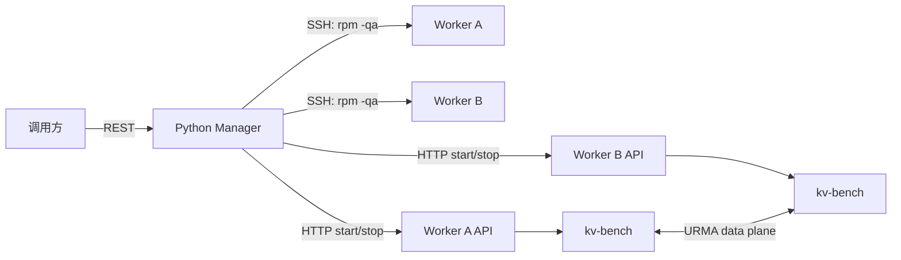

# kv-bench manager/worker

`manager` 是独立的 Python 控制组件。worker 是 `kv-bench --worker` 启动的常驻
HTTP 服务，不访问 manager；manager 通过 worker API 完成任务生命周期控制。



## 启动

```bash
python3 -m manager.app --port 18080
/opt/kv-bench/build/kv-bench --worker --worker-port=18082
```

## API

启动 manager 后访问 `http://manager:18080/` 打开 Console 页面，可进行节点管理、
部署、任务启停和结果聚合查看。页面只调用 manager API，不直接访问 worker。

部署接口 `POST /v1/deploy`：manager 对每个节点执行 `rpm -qa` 并筛选 `urma`；
版本集合不一致时，仅对不一致节点执行独立的 CMake 编译，然后复制 artifact。

```json
{
  "nodes": [{"name":"a","ip":"10.0.0.1","api_port":18082}],
  "artifact": "build/kv-bench",
  "destination": "/opt/kv-bench/build/kv-bench",
  "source_dir": "/opt/kv-bench",
  "umdk_root": "/opt/umdk"
}
```

任务接口 `POST /v1/tasks` 的 `bench_items` 按拓扑指定：

```json
{
  "task_id": "bench-1",
  "workers": [
    {"name":"a","ip":"10.0.0.1"},
    {"name":"b","ip":"10.0.0.2"}
  ],
  "bench_items": [{"src":"10.0.0.1","dst":"10.0.0.2","type":"bidirectional"}],
  "options": {"op":"write","threads":4,"duration":30}
}
```

manager 调用 worker API：

- `POST /v1/tasks/{id}/start`：manager 为拓扑生成每个 worker 的 kv-bench 参数，并调用 worker 的 `POST /v1/tasks/start`；worker 在同一 kv-bench 进程内启动测试线程。
- `POST /v1/tasks/{id}/stop`：调用相关 worker 的 `POST /v1/tasks/{id}/stop`。
- worker `GET /v1/health`：查看 worker 本地运行中的 kv-bench 任务。

节点管理 API：`GET /v1/nodes`、`POST /v1/nodes`、`DELETE /v1/nodes/{name}`。
节点信息保存在 manager 当前目录的 `nodes.json`；密码写入该文件但不会出现在
HTTP 响应或 Python 对象的 repr 中，生产环境应限制文件权限。

worker API 不接受 manager 地址，也没有注册/回连逻辑。
