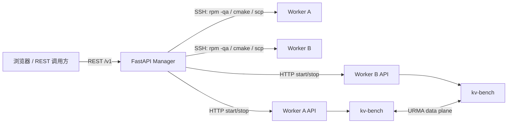

# kv-bench manager/worker

`manager` 是独立的 Python 控制组件，基于 **FastAPI + uvicorn**；前端为
**Vue 3 + Vite + Element Plus** 单页应用（由 manager 直接托管构建产物）。
worker 是 `kv-bench --worker` 启动的常驻 HTTP 服务，不访问 manager；manager
通过 worker API 完成任务生命周期控制。



## 安装依赖

```bash
python3 -m venv .venv && source .venv/bin/activate
pip install -r manager/requirements.txt
```

## 启动

```bash
python3 -m manager.app --port 18080          # manager（默认 0.0.0.0:18080）
/opt/kv-bench/build/kv-bench --worker --worker-port=18082   # 每个 worker
```

启动后访问 `http://manager:18080/` 打开管理界面（节点管理 / 部署 / 任务）。
API 文档（Swagger UI）在 `http://manager:18080/docs`。

## 前端（Vue 3 + Element Plus）

- 源码位于 `manager/web/`，构建产物 `manager/web/dist/` 由 FastAPI 自动托管
  （`dist/assets` 存在即生效；不存在时首页显示构建提示）。
- 开发模式（后端 18080 常驻，Vite 代理 `/v1`）：

  ```bash
  cd manager/web
  npm install
  npm run dev        # http://127.0.0.1:5173
  ```

- 生产构建（提交/部署前执行一次）：

  ```bash
  cd manager/web
  npm run build      # 产出 dist/，之后无需 Node 环境
  ```

## API

### 节点管理

- `GET /v1/nodes`（别名 `GET /v1/workers`）：节点列表（不含密码）。
- `POST /v1/nodes`：保存节点。节点可携带多个 `tags`（字符串列表），用于在
  部署与创建任务时按标签筛选节点。节点信息保存在 manager 当前目录的 `nodes.json`；
  密码写入该文件但不会出现在 HTTP 响应中，生产环境应限制文件权限。
- `DELETE /v1/nodes/{name}`：删除节点。
- `PATCH /v1/nodes/{name}`：更新节点标签（`{"tags": [...]}`），保留密码等其余字段。

示例（带标签）：

```json
{
  "name": "node-a",
  "ip": "10.0.0.1",
  "tags": ["gpu", "idle"]
}
```

### 部署

`POST /v1/deploy`：manager 对每个节点执行 `rpm -qa` 并筛选 `urma`；
版本集合不一致时，仅对不一致节点执行独立的 CMake 编译，然后复制 artifact
并以 nohup 启动 worker。

```json
{
  "nodes": [{"name":"a","ip":"10.0.0.1","api_port":18082}],
  "artifact": "build/kv-bench",
  "destination": "/opt/kv-bench/build/kv-bench",
  "source_dir": "/opt/kv-bench",
  "umdk_root": "/opt/umdk"
}
```

`umdk_root` 可选：留空（或省略）时，不一致节点的编译命令不加 `-DUMDK_ROOT`，
由 cmake 走系统/环境默认查找 URMA。

部署前 manager 会自动在远端 `mkdir -p` 目标目录（scp 不自动建目录）；
SSH/SCP 失败时返回 `{"error": "..."}` 并附 stderr 详情（如认证失败、
远端目录不可写、本地 artifact 不存在）。

worker 启动命令以整行作为单个参数通过 ssh 执行（避免远端 shell 分词把
`nohup` 拆成无参数），并在启动后探测 `/v1/health`：探测结果写入部署状态
（`worker_state` = ready / failed / started），节点管理页可查看。

响应 `{versions, consistent, reference}`：各节点 URMA 包版本、是否一致、参考版本。

### 任务

`POST /v1/tasks` 的 `bench_items` 按拓扑指定：

```json
{
  "task_id": "bench-1",
  "workers": [
    {"name":"a","ip":"10.0.0.1"},
    {"name":"b","ip":"10.0.0.2"}
  ],
  "bench_items": [{"src":"10.0.0.1","dst":"10.0.0.2","type":"bidirectional"}],
  "options": {"op":"write","threads":4,"duration":30}
}
```

manager 调用 worker API：

- `POST /v1/tasks/{id}/start`：manager 为拓扑生成每个 worker 的 kv-bench 参数，
  并调用 worker 的 `POST /v1/tasks/start`；worker 在同一 kv-bench 进程内启动测试线程。
- `POST /v1/tasks/{id}/stop`：调用相关 worker 的 `POST /v1/tasks/{id}/stop`。
- `GET /v1/tasks/{id}/result`：聚合各 worker 结果（`ops/bytes/errors` → `iops/带宽`），
  并落盘到 `runs/{task_id}/result.json`。
- `GET /v1/tasks/{id}/logs`：SSH `tail` 各 worker 的 `/var/log/kv-bench-worker.log`
  并保存到 `runs/{task_id}/logs/{worker}.log`（拉取失败写 `.error`），返回日志内容。
  kv-bench 的 `main()` 已对 stdout 设置行缓冲（`setvbuf(_IOLBF)`），
  printf 的区间统计/summary 实时落盘，任务期间即可 tail 到。
- worker `GET /v1/health`：查看 worker 本地运行中的 kv-bench 任务。

`options` 覆盖 kv-bench 全部打流参数（`_` 转 `-` 后透传为 CLI 参数）：
标量 `{"threads": 4}` → `--threads=4`；开关 `{"event_mode": true}` → `--event-mode`；
默认开启的开关可关闭：`{"mbind": false}` → `--no-mbind`、`{"drv_ext": false}` → `--no-drv-ext`。

## 持久化与运行产物

manager 运行目录（默认当前目录）下的文件：

| 文件 | 内容 |
| --- | --- |
| `nodes.json` | 节点配置（含 SSH 密码，注意文件权限） |
| `tasks.json` | 任务与状态（创建/启动/停止/结果实时持久化，manager 重启不丢） |
| `deploy_status.json` | 各节点部署状态（部署时间/artifact/URMA 版本一致性/worker 状态） |
| `runs/{task_id}/` | 每任务产物：`result.json`、`task.json`（任务快照）、`logs/{worker}.log`（SSH 拉取的 worker 日志）、`manager.log`（生命周期事件） |

## 测试

域逻辑测试仅依赖 Python 标准库（`fastapi`/`httpx` 缺失时自动跳过路由测试）：

```bash
python3 -m unittest discover -s manager/tests -v
```

## 备注

- 错误响应统一为 `{"error": "..."}`：pydantic 校验失败 422、逻辑错误 400、
  SSH/SCP/worker 调用等运行期失败 500（均带具体原因）。
- worker API 调用**绕过环境代理**（`httpx trust_env=False`，内网控制面直连）；
  manager 机器上配置的 HTTP_PROXY/HTTPS_PROXY 仅用于外网，不会劫持 worker 流量。
- worker API 不接受 manager 地址，也没有注册/回连逻辑。
